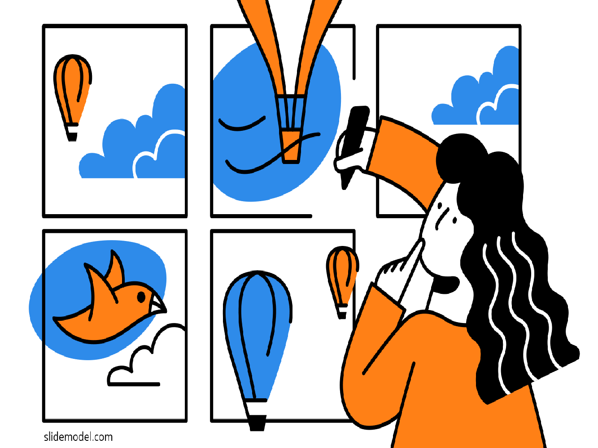

<nav class="site-main">
        
  

      
  

  

    
  

</nav>    
<section class="grid">
        
  <article class="card">
    

    

      <h1 class="card__header">Typography</h1>
      
I like typography because it can enrich our vision and convey people's information in time through careful design.

      <a href="typography(content).html" class="card__btn"><strong>View</strong></a> 
    

  </article>

  <article class="card">
    

    

      <h1 class="card__header">Mobile design</h1>
      
I like mobile design, it has different general requirements for design, requires detailed content, and is very challenging.

      <a href="/mobile(content)" class="card__btn"><strong>View</strong></a> 
    

  </article>

  <article class="card">
    

    

      <h1 class="card__header">Web design</h1>
      
I believe that website design brings me everything,  keep looking for inspiration in the design process and improving.

      <a href="/web(content)" class="card__btn"><strong>View</strong></a> 
      
    

  </article>

<article class="card">
  

    

      <h1 class="card__header">Storyboard</h1>
      
I love creating storyboards because it gives me the skills to clarify my thoughts while creating them.

      <a href="storyboard(content).html" class="card__btn"><strong>View</strong></a> 
    

  </article>
</section>

